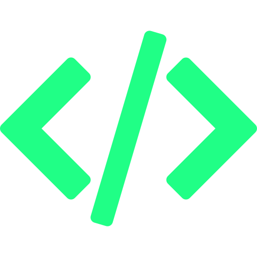

<h1> Hi, I'm Deus. </h1>

  

<!--

-->

##  About me

Hello world! I'm **Amadeus Gravoso**, a full-stack software engineer and creative visual designer based in the Philippines 🇵🇭. Driven by my passion for computers and all things tech, I turn imaginative ideas into practical solutions. 

  
 Status quo 

    

       
      steady as she goes
     

##  Stuff I do

##  My tech stack

Here are some of the technologies that I am invested in. Among these are programming and markup languages, frameworks, libraries, development environments, and software tools that I have used and worked with or am currently exploring. 
 

  
 My stack 

    
   
   **• Programming Languages**
  

    
  

  **• Frameworks & Libraries**
  

    
  

  **• Tools & Environments**
  

    
  

> Evidently, my interests gravitate towards front-end web and mobile development. However, I ultimately aim in becoming a full-stack software engineer.

 
